<div align="center">


# RareVerse

### Find the rare diseases that share your biology, and the people already working on them.

An evidence-first knowledge graph of rare diseases. Search one disease, gene or symptom: RareVerse puts it at the center,<br/>
ranks what shares its biology, shows the source of every claim, and finds the researcher to contact next.

<p>
<a href="https://github.com/vihuynh72/research-os/actions/workflows/ci.yml"></a>


</p>
<p>


</p>

**[Quick start](#quick-start)** · **[How it works](#how-it-works)** · **[Grading engine](#grading-engine)** · **[AI contact finder](#ai-contact-finder)** · **[Contributing](#contributing)**

<br/>

<picture>
  <source media="(prefers-color-scheme: dark)" srcset="docs/images/start-dark.webp" />
  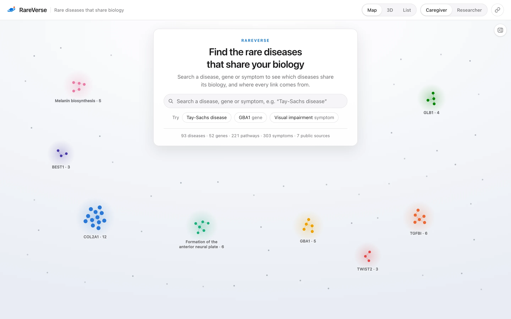
</picture>

</div>

---

<a id="why"></a>
## 💡 Why RareVerse exists

> **263–446 million people** live with a rare disease ([Nguengang Wakap et al., *European Journal of Human Genetics*, 2020](https://www.nature.com/articles/s41431-019-0508-0)), and **about 95% of rare diseases have no FDA-approved treatment** ([NIH NCATS](https://ncats.nih.gov/sites/default/files/NCATS_RareDiseasesFactSheet.pdf)).

For most of these diseases, the person pushing research forward is a parent. They know the name of their child's disease, and maybe the gene. What they cannot see is **which other diseases break the same biology**. A mouse model, a natural-history study, a registry design or a gene-therapy approach built for one of those diseases could serve theirs. A disease with 200 known patients can borrow momentum from one with 2,000. The knowledge exists, but it is scattered across a dozen databases built for specialists.

RareVerse joins seven of those databases into one map and answers three questions in plain language, **with a source behind every answer**:

| | Question | What RareVerse shows |
|:---:|---|---|
| 🧬 | **Who shares our biology?** | Diseases ranked by shared genes, shared Reactome pathways and similar gene changes, not by name. Distance on the map *is* that score. |
| 📚 | **What already exists?** | Patient groups, papers and research grants linked to the disease and to its biological relatives, each tagged *stated by a curated database* or *inferred*. |
| 🤝 | **Who do we call next?** | A sourced next step (or an honest "nothing yet"), and an AI contact finder that turns the papers behind a disease into **verified** researcher contacts. |

> [!IMPORTANT]
> RareVerse never invents a link. Every number is computed by deterministic, tested code from public records, every claim on screen carries a numbered citation, and the AI layer can only *lower* a grade or find people. It can never raise a grade or add a fact.

---

<a id="features"></a>
## ✨ What you can do

<table>
<tr>
<td width="50%" valign="top">
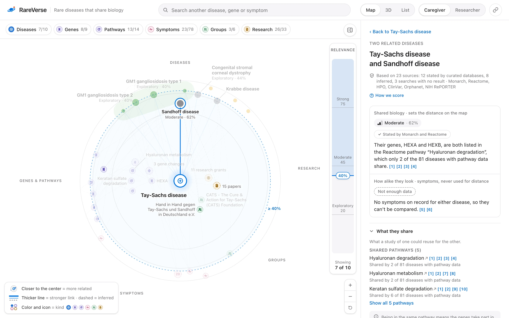
<br/><b>🎯 Read the map.</b> What you searched sits in the center. The closer a disease, the more biology it shares; the direction tells you what kind of thing it is. Click any link to read <i>why</i>, with sources.
</td>
<td width="50%" valign="top">
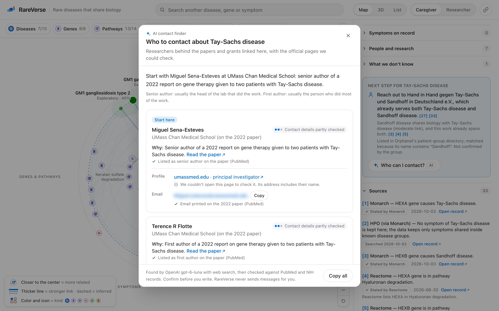
<br/><b>🤖 Find who to contact.</b> One button turns the papers and grants behind a disease into researchers to write to. Every person, page and email is checked on the server before you see it.
</td>
</tr>
<tr>
<td width="50%" valign="top">
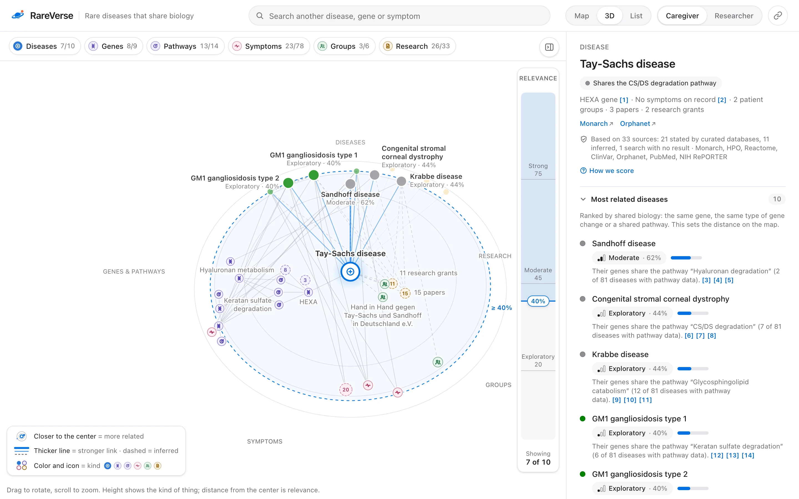
<br/><b>🧊 Explore in 3D.</b> The same map, tilted: height shows the kind of thing and distance shows relevance. Drag to rotate, scroll to zoom.
</td>
<td width="50%" valign="top">
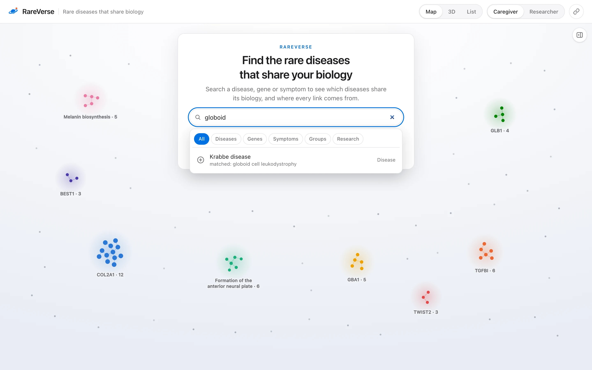
<br/><b>🔎 Search the way people talk.</b> About 1,900 synonyms from Monarch (MONDO, HGNC) and HPO, typo tolerance and plurals: "globoid" finds Krabbe disease, "vision loss" finds Visual impairment, "gaushur" finds Gaucher.
</td>
</tr>
</table>

<details>
<summary><b>Everything else in the box</b></summary>

| | Feature | Details |
|:---:|---|---|
| 🌌 | **The RareVerse universe** | The start screen draws all 93 diseases as constellations: colored groups that share a gene or a pathway, with every other disease as a faint star. Click any star to map it. |
| 📚 | **A citation on every claim** | Every sentence in the side panel ends with numbered chips like `[1]`. Hovering one opens a source card (database, claim, date, record link), and a full Sources list closes each view. |
| ⚖️ | **Honest scores** | Biology sets the distance on the map. Clinical resemblance (symptoms, onset, inheritance) is shown beside it and never moves a disease, and neither does shared research. Thin or one-sided evidence comes with a plain-language caveat. |
| 🧭 | **A next step** | Built only from sourced items: a group that already serves both diseases, a registry, a grant, a paper. When nothing supports a step, RareVerse says so and offers the contact finder. |
| 🎚️ | **Relevance filter** | The map opens on the top five related diseases. Lower the slider to bring weaker and indirect links in; items just under the filter stay faintly visible. |
| 🧩 | **Type and link filters** | Show only genes, only symptoms, only research. The researcher view adds a *Links* menu that hides whole relation types. |
| 👩‍🔬 | **Researcher mode** | Dimension-by-dimension score tables, the engine's own note, node ids linked to their databases, and the "How we score" explainer. |
| 🔗 | **Shareable views** | The whole state lives in the URL (`?d=MONDO:0010100&sel=MONDO:0010006&r=40&view=3d`), so any view can be linked or bookmarked. |
| 📋 | **List view** | The same neighborhood as a ranked, readable list. |
| 🌗 📱 ♿ | **Dark mode, phones, accessibility** | A designed dark theme, a phone layout, keyboard navigation, focus rings, screen-reader labels and reduced-motion support. |

</details>

---

<a id="walkthrough"></a>
## 🎬 A walk through RareVerse in five clicks

A parent whose child has **Tay-Sachs disease** opens RareVerse. Everything below is real output from the current atlas:

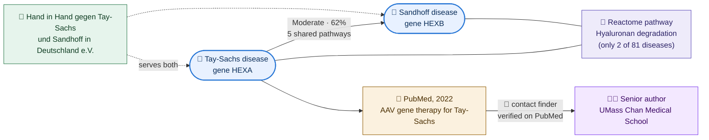

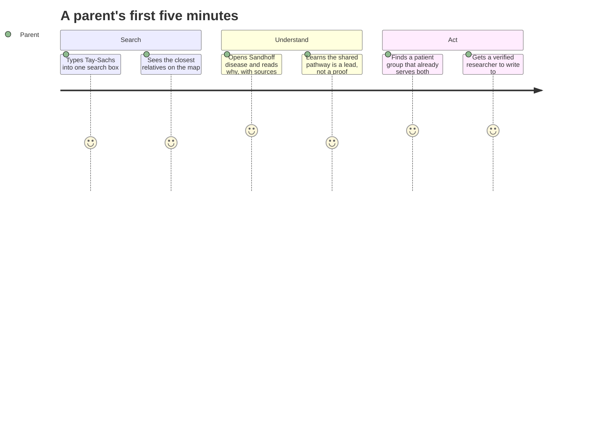

---

<a id="how-it-works"></a>
## 🧠 How it works

RareVerse is three layers: a **pipeline** that pulls public records into one graph, a **deterministic grading engine** that scores every pair of diseases, and a **Next.js app** that turns both into a map a parent can read. One small server route adds the AI contact finder.

```mermaid
flowchart LR
    subgraph SRC["🌐 7 public sources"]
        direction TB
        MON["Monarch · MONDO<br/>disease ↔ gene"]
        HPO["Human Phenotype Ontology<br/>symptoms"]
        REA["Reactome 97<br/>pathways"]
        CLV["ClinVar<br/>gene changes"]
        ORP["Orphanet<br/>patient groups"]
        PUB["PubMed<br/>papers"]
        NIH["NIH RePORTER<br/>grants"]
    end
    subgraph PIPE["🐍 Python pipeline"]
        direction TB
        BG["build_graph.py<br/>fetch and link"] --> WG["weight_graph.py<br/>information-content weights"]
    end
    subgraph BUILD["🧱 Deterministic build"]
        direction TB
        REF["data:hpo · data:reactome<br/>reference files"] --> ADP["data:graph<br/>schema adapter"]
        ADP --> GRD["grade<br/>11-dimension engine"]
    end
    subgraph APP["⚛️ Next.js app"]
        direction TB
        UI["Map · 3D · List<br/>Evidence panel · Search"]
        API["/api/contacts<br/>server only"]
    end
    SEED[("rare_graph.json<br/>seed")]
    OUT[("graph.json<br/>relevance.json")]
    OAI["🤖 OpenAI<br/>gpt-6-luna + web search"]
    SRC --> PIPE --> SEED --> BUILD --> OUT --> UI
    UI --> API --> OAI
    classDef src fill:#E8F1FF,stroke:#2A78D6,color:#0B2E59
    classDef py fill:#FFF4E5,stroke:#EDA100,color:#5A3B00
    classDef ts fill:#EEEBFA,stroke:#5B4BB7,color:#2B2266
    classDef data fill:#E6F4EC,stroke:#2B7A4B,color:#0F3D22
    classDef app fill:#FCEBF1,stroke:#B23C68,color:#5C1530
    classDef ai fill:#F3E8FF,stroke:#7C3AED,color:#3B0764
    class MON,HPO,REA,CLV,ORP,PUB,NIH src
    class BG,WG py
    class REF,ADP,GRD ts
    class SEED,OUT data
    class UI,API app
    class OAI ai
```

### Inside the app

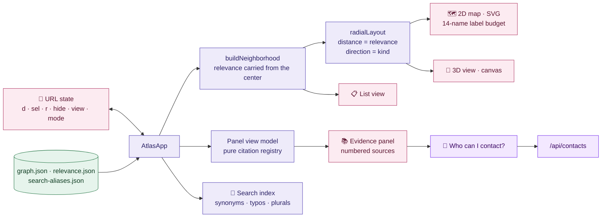

**Placement means something.** On the map, distance from the center is relevance and direction is the kind of thing. Nothing is placed by hand, and the same input always gives the same picture.

| Direction | What lives there |
|---|---|
| ⬆️ Top | Related **diseases**, the five closest drawn largest and labeled with their grade (`Moderate · 62%`) |
| ↗️ Upper right | **Research**: papers and grants |
| ↘️ Lower right | **Patient groups** and registries |
| ⬇️ Bottom | **Symptoms**, rarest first |
| ⬅️ Left | **Genes and pathways** |

---

<a id="knowledge-graph"></a>
## 🕸️ The knowledge graph

**1,122 nodes and 1,891 typed, sourced edges** covering 93 rare diseases (a deliberately focused slice: the engine and the app are built to grow).

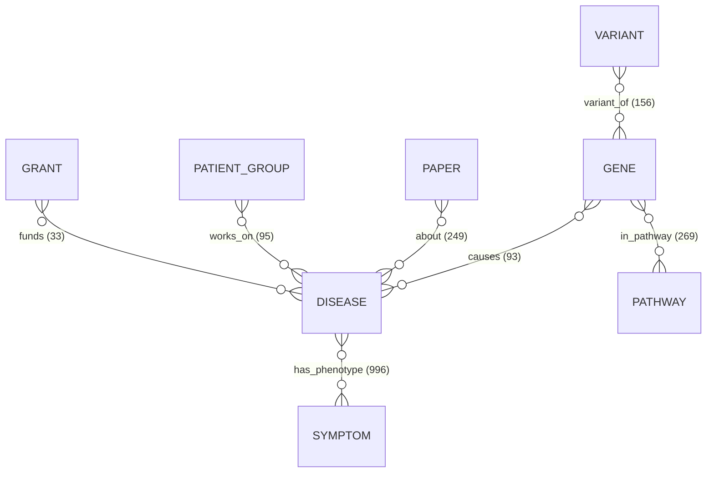

<table>
<tr>
<td width="50%">

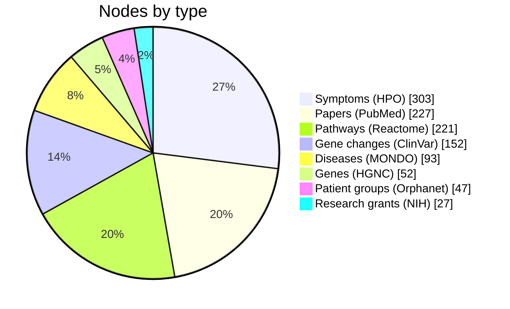

</td>
<td width="50%">

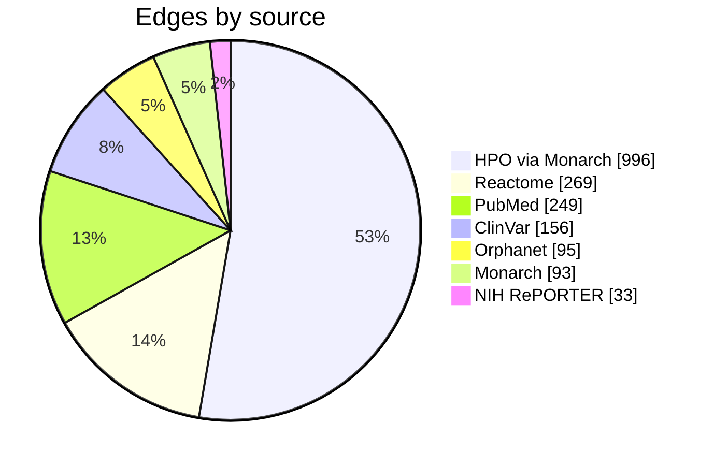

</td>
</tr>
</table>

**Every edge carries its provenance.** The contract is [`schema.json`](schema.json) (JSON Schema 2020-12), checked in CI:

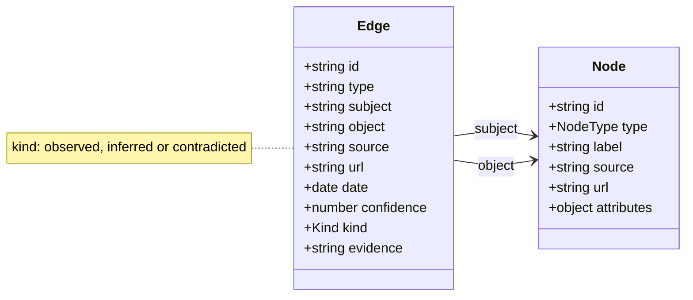

| Source | What it contributes | Edges | Kind |
|---|---|---:|---|
| [Monarch Initiative](https://monarchinitiative.org) (MONDO) | gene → disease, disease identity, synonyms for search | 93 | 🟢 stated |
| [Human Phenotype Ontology](https://hpo.jax.org) | symptoms per disease; information content and null model for scoring | 996 | 🟢 stated |
| [Reactome](https://reactome.org) (release 97) | gene → pathway, lowest-level human pathways only | 269 | 🟢 stated |
| [ClinVar](https://www.ncbi.nlm.nih.gov/clinvar/) | pathogenic gene changes | 156 | 🟢 stated |
| [Orphanet](https://www.orpha.net) | patient organisations | 95 | 🟡 name match |
| [PubMed](https://pubmed.ncbi.nlm.nih.gov) | papers | 249 | 🟡 search match |
| [NIH RePORTER](https://reporter.nih.gov) | research grants | 33 | 🟡 search match |

In total, 1,514 edges are stated by a curated database and 377 are inferred, and the app always says which is which.

---

<a id="grading-engine"></a>
## ⚖️ The grading engine

The heart of RareVerse is a deterministic engine in [`lib/grading/`](lib/grading) that decides **which diseases are related, how strongly, and why**. The full specification lives in [`docs/grading.md`](docs/grading.md). Four rules shape everything:

> [!NOTE]
> 1. **Three scores, never mixed.** *Biology* (same gene, same kind of gene change, same pathway) is the only number that sets distance on the map. *Clinical resemblance* (symptoms, onset, inheritance) is shown beside it. *Collaboration* (shared groups, papers, studies, grants, researchers, registries) never moves a disease.
> 2. **The engine computes, the AI only reviews.** AI judgments can lower a tier or add a caveat. They never raise a grade or change a number.
> 3. **No number without a source.** Every shared item carries the ids of the edges behind it.
> 4. **A test holds the engine to the literature.** A literature-rated answer key fails the build when grades drift.

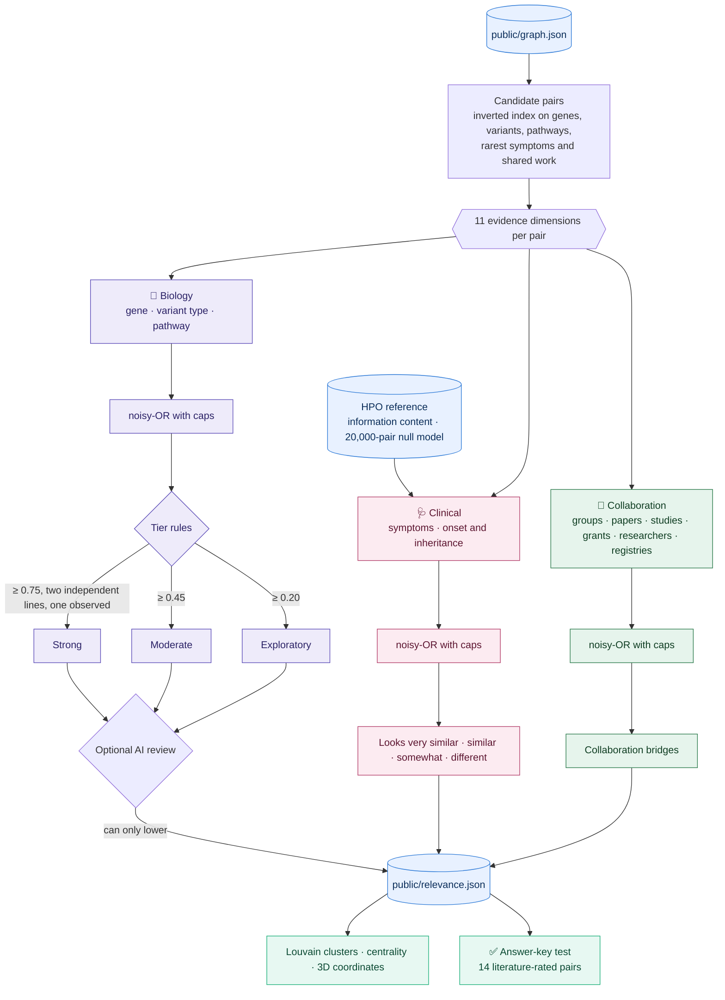

### Eleven dimensions in three families

| Family | Dimension | What is compared | Cap |
|---|---|---|:---:|
| 🧬 Biology | `gene` | Genes linked to each disease | 0.70 |
| 🧬 Biology | `mechanism` | Reactome pathways reached through the disease or its genes: the most specific shared one | 0.80 |
| 🧬 Biology | `variant` | Share of loss-of-function changes, read from HGVS notation (a modifier) | 0.25 |
| 🩺 Clinical | `phenotype` | HPO symptom profiles, information-weighted (SimGIC) and scaled between two anchors | 0.75 |
| 🩺 Clinical | `disease` | Onset and mode of inheritance (a modifier) | 0.40 |
| 🤝 Collaboration | `patient_org` · `asset` | Patient groups and registries | 0.50 |
| 🤝 Collaboration | `trial` · `investigator` | Clinical studies and researchers | 0.40 |
| 🤝 Collaboration | `paper` · `grant` | Papers and research grants | 0.30 |

Within a family, independent lines of evidence combine as a **noisy-OR with caps**, so agreement is what makes a link strong and no combination ever reaches 1. Two different diseases are never the same disease:

$$\text{biology} = 1-(1-0.7\,g)\,(1-0.8\,m)\,(1-0.25\,v^{\ast}) \qquad \text{clinical} = 1-(1-0.75\,s)\,(1-0.4\,d^{\ast})$$

<sup>∗ modifiers count only when the pair already shares a gene or a pathway (for <i>v</i>) or some symptoms (for <i>d</i>).</sup>

<details>
<summary><b>🔬 Deep dive: how a pathway, a symptom and a gene change are weighed</b></summary>

<br/>

**A pathway is only as telling as it is rare.** A pathway shared by every disease cannot tell any two apart. For a Reactome pathway reached by *n* of the *N* diseases with pathway data (*N* = 81 here), the engine uses information content normalized so that a pathway shared by exactly two diseases weighs 1. Big pathways are discounted by their size in proteins:

$$w(p)=\max\!\left(0.15,\ \operatorname{clamp}\!\left(\frac{1-\ln n/\ln N}{1-\ln 2/\ln N},0,1\right)\right)\times\operatorname{clamp}\!\left(1-\frac{\ln(\text{proteins})}{\ln 20000},\,0.1,\,1\right)$$

The pair scores the weight of the **most specific** pathway both diseases reach (Resnik's most informative common ancestor), so a gene that sits in many pathways cannot dilute the one it really shares.

| Reactome pathway | Proteins | Diseases reaching it | Weight |
|---|---:|---:|---:|
| Galactose catabolism | 6 | 3 of 81 | 0.729 |
| Hyaluronan degradation | 16 | 2 of 81 | 0.720 |
| Melanin biosynthesis | 5 | 5 of 81 | 0.630 |
| Glycosphingolipid catabolism | 39 | 12 of 81 | 0.325 |

**A symptom is only as telling as it is rare.** "Seizure" is shared by hundreds of unrelated diseases, while "large clumps of pigment along the hair shaft" points at a handful. Each HPO term gets an information content over all 12,880 annotated diseases, symptom sets are closed upward through the ontology, and two diseases are compared with SimGIC (Pesquita et al., 2008):

$$\mathrm{ic}(t)=-\frac{\ln(n_t/N)}{\ln N}\qquad \mathrm{SimGIC}(A,B)=\frac{\sum_{t\in A^{\uparrow}\cap B^{\uparrow}}\mathrm{ic}(t)}{\sum_{t\in A^{\uparrow}\cup B^{\uparrow}}\mathrm{ic}(t)}$$

A raw score means nothing on its own, so it is **calibrated against two anchors measured on HPO's whole corpus**: 0 at the 99th percentile of **20,000 random disease pairs** (SimGIC 0.1636), and 1 at the median of **497 pairs of OMIM and Orphanet records of the same disease** (SimGIC 0.3173). That is how the panel can honestly say "about as much overlap as two records of the same disease".

**A shared gene is one line of evidence, never three.** Gene changes and pathways hang off the gene, so a gene shared by two diseases would otherwise count three times. The engine sets them aside for allelic pairs (`same_gene_allelic`). One shared gene alone is therefore *moderate*, never strong, because the same gene can be broken in opposite ways (NOTCH2: Hajdu-Cheney syndrome versus Alagille syndrome 2).

</details>

### Tiers, with rules that can only pull a link down

| Biology tier | Score | Extra rule |
|---|:---:|---|
| 🟣 **Strong** | ≥ 0.75 | needs at least **two independent lines** of evidence, one of them stated by a curated source |
| 🔵 **Moderate** | ≥ 0.45 | a gene-change conflict caps a pair here |
| ⚪ **Exploratory** | ≥ 0.20 | a contradicted biology edge caps a pair here |

Clinical resemblance has its own words: *looks very similar* (≥ 0.65), *similar* (≥ 0.40), *somewhat similar* (≥ 0.20) or *different*, and a thin symptom record caps it.

### Real grades from the current atlas

| Pair | Biology | Why, in the engine's own terms |
|---|:---:|---|
| Griscelli syndrome 1 ↔ 2 | 🔵 0.655 | two shared pathways; both genes' ClinVar records mostly loss-of-function |
| Tay-Sachs ↔ Sandhoff | 🔵 0.629 | five shared pathways, the most specific *Hyaluronan degradation* (2 of 81) |
| Galactokinase deficiency ↔ classic galactosemia | 🔵 0.584 | *Galactose catabolism* (3 of 81 diseases) |
| Tietz syndrome ↔ COMMAD | 🔵 0.70 | same gene (MITF); whether both break it the same way is unknown |
| Stickler syndrome 1 ↔ osteopetrosis 3 | ⚪ 0.241 | one broad developmental pathway (13 of 81) |

### Held to the literature, honestly

[`data/curated/answer_key.json`](data/curated/answer_key.json) rates **14 pairs** from the literature (high, medium or low), each with a reason and a PubMed or Reactome source. [`lib/grading/answer-key.test.ts`](lib/grading/answer-key.test.ts) runs in CI and fails if the engine orders them differently or tiers them wrongly. **9 of 14 pairs hold.** The other 5 are documented as known disagreements, each with its cause (the data or the engine's priors), not hidden. A clinician can edit the key and rerun `npm test` to recalibrate.

> [!TIP]
> **Scale.** Comparing every disease with every other is quadratic, so candidate pairs come from an inverted index plus a set-similarity prefix filter. The whole atlas (4,278 disease pairs, 1,040 with something gradable) grades in **about 60 ms**, and the output is byte-identical on every run. CI checks that.

---

<a id="ai-contact-finder"></a>
## 🤖 AI contact finder: "Who can I contact?"

The moment that matters is when a family decides to write to someone. RareVerse makes that one click. It is also built so that the AI **cannot invent a person, a page or an email**.

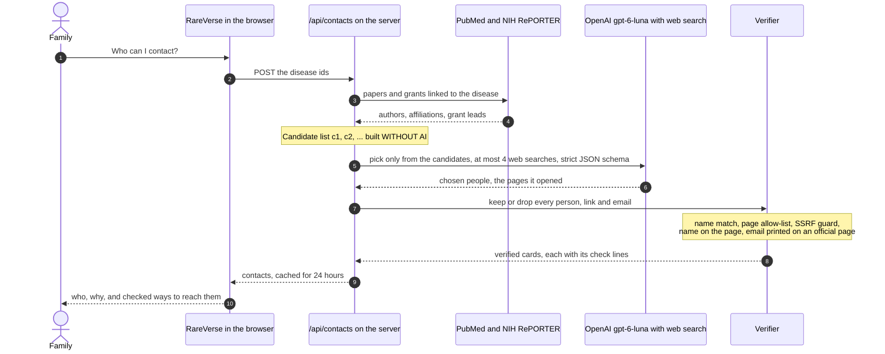

| Guarantee | How it is enforced |
|---|---|
| 👤 Only real researchers | Candidates are the senior, first and corresponding authors of linked PubMed papers and the leads of linked NIH grants. The model must pick by id, and the server drops anyone whose name does not match. |
| 🔗 Only pages it actually opened | Every URL must appear among the web-search sources, the citations or our PubMed/NIH links. |
| 📄 Pages are checked | Profile and lab pages are fetched (6 s, 1 MB, public hosts only, behind an SSRF guard) and must name the person. A page that blocks automated readers is kept only when its own address names them, and the card says it could not be opened. |
| ✉️ No guessed emails | An email is shown only if it is printed on the official page or in the PubMed record, and it must belong to that person. |
| 🧾 No unchecked prose | The model's free-text notes are never shown. Each "why" is checked against the PubMed or NIH record, and replaced by one written from the record when it claims more. |
| 🔐 Key never leaves the server | `OPENAI_API_KEY` is read only in a `server-only` module, is never sent to the browser and is never logged. |
| 💸 Cost control | A 24-hour cache, 6 new searches per visitor per 10 minutes, at most 2 OpenAI calls at once, and a server-wide hourly cap (30 by default). |

---

<a id="quick-start"></a>
## 🚀 Quick start

### Prerequisites

| Tool | Version | Needed for |
|---|---|---|
| [Node.js](https://nodejs.org) | **24** (what CI uses); 22.18+ also runs the TypeScript scripts | the app, the build scripts, the tests |
| npm | 10+ (ships with Node) | installing |
| [Python](https://www.python.org) | 3.10+, standard library only | rebuilding the seed graph from the public APIs (optional) |
| [OpenAI API key](https://platform.openai.com/api-keys) | any key with access to the model you choose | the "Who can I contact?" button (optional) |

### Run it locally in five steps

```bash
# 1. Clone
git clone https://github.com/vihuynh72/research-os.git
cd research-os

# 2. Point the lockfile at the public npm registry.
#    It was generated on Replit, whose package mirror is private; CI does exactly this.
node -e "const f='package-lock.json',fs=require('fs');fs.writeFileSync(f,fs.readFileSync(f,'utf8').replaceAll('http://package-firewall.replit.internal/npm/','https://registry.npmjs.org/'))"

# 3. Install the exact locked versions
npm ci

# 4. (Optional) turn on the AI contact finder
cp .env.example .env.local   # then put your key in .env.local

# 5. Start the app
npx next dev --port 3000
```

Open **http://localhost:3000**. The graph and the grades are committed, so the app runs right away with no API calls. Only the contact finder needs a key.

> [!WARNING]
> `npm run dev` binds to `0.0.0.0:5000` (that is what Replit expects). On macOS, port 5000 belongs to the **AirPlay Receiver**, so use `npx next dev --port 3000` as above, or turn off AirPlay Receiver in System Settings.

> [!TIP]
> Step 2 edits `package-lock.json`. Don't commit that change: `git checkout -- package-lock.json` restores it after installing.

### Production build

```bash
npm run build
npx next start --port 3000
```

### Check everything, exactly like CI

```bash
npm run check:schema           # schema.json and public/graph.json
npm run data:graph -- --check  # the graph rebuilds byte for byte from its committed inputs
npm test                       # 321 tests, including the literature answer key
npm run grade:check            # the committed grades match the engine
npm run typecheck              # TypeScript, no emit
```

<details>
<summary><b>🛠️ Troubleshooting</b></summary>

| Symptom | Fix |
|---|---|
| `npm ci` fails with `ENOTFOUND package-firewall.replit.internal` | Run step 2 (the lockfile still points at Replit's private mirror). |
| `EADDRINUSE :5000`, or a 403 page from AirPlay | Use `npx next dev --port 3000`, or turn off AirPlay Receiver. |
| `Unknown file extension ".ts"` when running a script | Use Node 24 (or 22.18+): the scripts are TypeScript run natively by Node. |
| "Who can I contact?" says the AI search is not set up | Put `OPENAI_API_KEY` in `.env.local` and restart the server. |
| A hydration warning that mentions extension attributes | A browser extension (such as Grammarly) edited the page before React loaded. It is harmless, and RareVerse already ignores it on `<html>` and `<body>`. |

</details>

---

<a id="environment"></a>
## 🔐 Environment variables and secrets

Copy [`.env.example`](.env.example) to **`.env.local`**. Git ignores every `.env*` file except the example. Every variable is optional: without any of them, the whole atlas works and only the contact finder is off.

| Variable | Default | What it does |
|---|---|---|
| `OPENAI_API_KEY` | (none) | Turns on the AI contact finder. **Server-side only.** |
| `OPENAI_MODEL` | `gpt-6-luna` | The model the contact finder uses (it needs the Responses API web-search tool). |
| `CONTACTS_MAX_SEARCHES_PER_HOUR` | `30` | New OpenAI searches per hour for the whole server. Repeated questions come from the cache for free. |
| `CONTACTS_TRUSTED_PROXY_HOPS` | `0` | How many proxies in front of the server append the visitor's address to `X-Forwarded-For` (often `1` on a hosting platform). `0` trusts none, so every visitor shares one rate limit. |
| `NCBI_TOOL` · `NCBI_EMAIL` | (unset) | Optional: identify your deployment to NCBI when reading PubMed. |
| `ATLAS_DATA_DIR` | `./public` | Load `graph.json` and `relevance.json` from another folder. |

> [!CAUTION]
> Never commit a real key, never prefix it with `NEXT_PUBLIC_`, and set a monthly budget on your OpenAI project. On a hosted deployment (Replit, Vercel, …) put the key in the platform's **Secrets** panel, not in a file.

---

<a id="rebuilding-the-data"></a>
## 🔁 Rebuilding the data

The committed files are enough to run and grade the atlas. To regenerate them from the public APIs, run the steps in this order:

```mermaid
flowchart LR
    C[["candidates.json<br/>diseases to include"]] --> BG["🐍 build_graph.py<br/>Monarch · ClinVar · PubMed<br/>NIH RePORTER · Orphanet"]
    BG --> SEED[("data/seed/rare_graph.json")]
    SEED --> HPO["npm run data:hpo<br/>HPO release → IC, null model, anchors"]
    HPO --> WG["🐍 weight_graph.py<br/>weights on the seed"]
    WG --> REA["npm run data:reactome<br/>Reactome Analysis Service"]
    REA --> G["npm run data:graph<br/>→ public/graph.json"]
    G --> GR["npm run grade<br/>→ public/relevance.json"]
    GR --> AL["node scripts/build-search-aliases.ts<br/>→ public/search-aliases.json"]
    classDef py fill:#FFF4E5,stroke:#EDA100,color:#5A3B00
    classDef ts fill:#EEEBFA,stroke:#5B4BB7,color:#2B2266
    classDef data fill:#E6F4EC,stroke:#2B7A4B,color:#0F3D22
    class BG,WG py
    class HPO,REA,G,GR,AL ts
    class C,SEED data
```

```bash
python3 pipeline/build_graph.py data/raw/candidates.json   # public records → data/seed/rare_graph.json
npm run data:hpo                                           # HPO files → data/reference/hpo-reference.json
python3 pipeline/weight_graph.py                           # information-content weights on the seed
npm run data:reactome                                      # Reactome → data/reference/reactome-pathways.json
npm run data:graph                                         # seed + references → public/graph.json
npm run grade                                              # → public/relevance.json + data/grading/bundles.json
node scripts/build-search-aliases.ts                       # optional: synonyms for search (about a minute)
```

- **The candidate list is yours to choose.** `pipeline/build_graph.py` reads a JSON file whose `kept` array lists the diseases to include (MONDO id, name, gene symbol and HGNC id, Orphanet code). It lives in the git-ignored `data/raw/`, so bring your own to grow or change the atlas.
- **Downloads are cached** in `data/raw/` (git-ignored). `--refresh` fetches again; otherwise a rebuild is offline.
- **Determinism is enforced.** `npm run data:graph -- --check` and `npm run grade:check` exit 1 on any byte that differs, and CI runs both.
- `pipeline/export_atlas.py` is an alternative Python exporter. The app's canonical files come from `data:graph` and `grade`, the same scripts CI checks.

---

<a id="hard-parts"></a>
## 🏔️ Why this was hard

| Challenge | How RareVerse solves it |
|---|---|
| **Public data is messy.** Phenotype labels arrive out of order, patient groups match on generic words such as "disease", and titles carry `&amp;`. | Labels are re-read from HPO by id, a word list drops generic name matches, entities are decoded once, and every gap is recorded rather than filled. |
| **Evidence is not independent.** One shared gene drags its gene changes and pathways along, which would look like three agreeing facts. | Allelic evidence counts once. Pathways that only come with the shared gene are set aside, and a *strong* link needs two independent lines. |
| **Not all overlap is meaningful.** "Seizure" is everywhere. | Information content over 12,880 diseases, SimGIC over ontology closures, and calibration against a 20,000-pair null model and same-disease anchors. |
| **Big pathways say little.** | Atlas-level specificity (Resnik-style IC) times a protein-count discount, scored on the most specific shared pathway. |
| **Trust.** A parent will bring this to a doctor. | Every sentence is built from structured fields with numbered citations, each edge is tagged stated or inferred, absences cite the dataset searched, and a literature answer key gates CI. |
| **AI hallucination.** | The model chooses only from a candidate list built without AI, and the server verifies every page and email before anything renders. |
| **Readable at a glance.** 150 neighbors want to be on screen. | A deterministic radial layout keeps distance honest at every filter value (a property tested at all 101 percent steps), with a 14-name label budget and collision-free label placement. |
| **Two audiences.** | Caregiver and researcher views of the same evidence: plain words for one, score tables and ids for the other. |
| **Reproducibility.** | Seeded randomness, sorted iteration and byte-identical outputs checked in CI. Same inputs, same bytes. |

<p align="center">


</p>

---

<a id="ci"></a>
## ✅ Quality gates

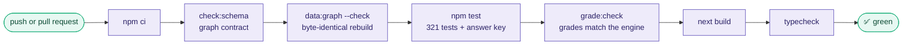

The **321 tests** across 34 files cover the grading engine and the literature answer key, the graph adapter and search (synonyms, typos, plurals), map invariants (honest distance at every filter value, label budget, deterministic layouts), the panel's citation registry and view models, URL state, the 3D scene, and the contact finder (PubMed parsing, verification rules, SSRF guard, rate limits).

### npm scripts

| Script | What it does |
|---|---|
| `npm run dev` | Development server on `0.0.0.0:5000` (Replit). Locally, prefer `npx next dev --port 3000`. |
| `npm run build` · `npm start` | Production build and server. |
| `npm test` | All unit tests, run with Node's built-in test runner. |
| `npm run typecheck` | TypeScript, no emit. |
| `npm run check:schema` | Validate `schema.json`, its example and `public/graph.json`. |
| `npm run data:hpo` | Build the HPO reference (information content, null model, anchors). |
| `npm run data:reactome` | Fetch Reactome pathways for the atlas's genes. |
| `npm run data:graph` | Seed + references → `public/graph.json` (`-- --check` to verify). |
| `npm run grade` · `grade:check` | Grade the atlas → `public/relevance.json` (or verify it). |

---

<a id="project-structure"></a>
## 📁 Project structure

```text
research-os/
├── app/                      Next.js App Router: page, layout, icon
│   └── api/
│       ├── contacts/         POST /api/contacts: the AI contact finder (server only)
│       └── refresh/          POST /api/refresh: rebuild graph + grades (local development only)
├── components/atlas/         the product UI
│   ├── map/                  label budget, line styles, universe layout, legend, kind chips
│   ├── panel/                view model, citation registry, disease / pair / node views
│   ├── contact/              the "Who can I contact?" dialog
│   ├── KnowledgeGraph.tsx    the 2D map (SVG)
│   ├── Graph3D.tsx           the 3D view (canvas)
│   └── AtlasApp.tsx          state, URL sync, layout
├── lib/
│   ├── grading/              the deterministic grading engine (+ answer-key test)
│   ├── graph/                graph index and search, neighborhood builder, next steps
│   ├── contacts/             PubMed, NIH, OpenAI, verification, SSRF guard, limits
│   ├── viz/                  radial layout and 3D projection math
│   └── data/                 data loader
├── pipeline/                 Python: fetch public records → seed graph, weights, clusters
├── scripts/                  TypeScript build steps: adapter, HPO, Reactome, grading, search synonyms
├── data/                     seed graph, reference files, answer key, grading bundles
├── public/                   graph.json, relevance.json, search-aliases.json (what the app loads)
├── docs/grading.md           the grading engine, in depth
└── schema.json               the graph contract (JSON Schema 2020-12)
```

---

<a id="contributing"></a>
## 🤝 Contributing

RareVerse is built to be extended: by developers, by data people, and by clinicians who can tell us where the engine is wrong. Contributions of every size are welcome.

1. **Fork** the repository and create a branch: `git checkout -b feature/your-idea`.
2. Make your change, and keep `npm test`, `npm run typecheck` and the `--check` scripts green.
3. **Open a pull request** that says what changed and why. Screenshots help for UI work.

**House rules** (they are what make RareVerse trustworthy):

- 🧾 **No claim without a source.** Every edge needs `source`, `url`, `date` and `kind` (observed, inferred or contradicted). If the data does not say it, the UI says "not on record".
- 🎯 **Deterministic by default.** Same inputs, same bytes: no unseeded randomness, no order that depends on the machine.
- 🤖 **AI may lower, never raise.** Model output can add a caveat, cap a tier or propose contacts that are then verified. It never creates a grade or a fact.
- 🗣️ **Plain words for families.** Jargon belongs in the researcher view.
- 🔐 **Secrets stay on the server.** Never commit keys, and never expose them to the browser.

### 🌱 Good first contributions

| Idea | Why it matters |
|---|---|
| Fetch **ClinVar variants per condition** | It would tell diseases of the same gene apart (same mechanism or opposite ones). |
| Add **onset and inheritance** from HPO annotations | The clinical "onset and inheritance" dimension is ready but unfed. |
| Ingest **ClinicalTrials.gov** studies as trial nodes | Families need recruiting studies, and the panel already knows how to show them. |
| Make **NIH grant leads** researcher nodes | It would complete the "who is working on this" network. |
| **Clinician review** of the answer key | One edited JSON file recalibrates the engine. |
| **Collaboration brief** export | A sourced proposal for two groups to share research (the button is waiting). |
| Grow the atlas past **93 diseases** | The engine's weights are relative to the atlas, so more diseases give sharper signals. |
| **Translations** | Many rare-disease families do not read English. |

### 🧭 Roadmap

- [x] Evidence-first knowledge graph from 7 public sources
- [x] Deterministic grading engine with a literature answer key
- [x] Map, 3D and list views; search with synonyms and typo tolerance
- [x] Numbered citations on every claim
- [x] AI contact finder with server-side verification
- [ ] Collaboration brief (export a sourced research proposal)
- [ ] Clinical studies and researchers as first-class nodes
- [ ] Per-condition gene changes
- [ ] Clinician-reviewed answer key
- [ ] 1,000+ diseases

---

> [!WARNING]
> **RareVerse is a research and discovery tool, not medical advice.** Grades describe shared biology in public records. They are not diagnoses or treatment recommendations. Known limits are documented in [`docs/grading.md`](docs/grading.md#15-limitations): for example, some diseases have no symptoms on record yet, and gene changes are recorded per gene rather than per disease.

## 👥 Team

<table>
<tr>
<td align="center" width="33%"><b>Vi Huynh</b></td>
<td align="center" width="33%"><b>Jaspal Saluja</b></td>
<td align="center" width="33%"><b>Paul Marquardt</b></td>
</tr>
</table>

<p align="center">Built at the 7th Global AI Hackathon (Hack-Nation, 2026).</p>

## 🙏 Acknowledgements

RareVerse stands on public science: the [Monarch Initiative](https://monarchinitiative.org), the [Human Phenotype Ontology](https://hpo.jax.org), [Orphanet](https://www.orpha.net), [Reactome](https://reactome.org), [ClinVar](https://www.ncbi.nlm.nih.gov/clinvar/), [PubMed](https://pubmed.ncbi.nlm.nih.gov) and [NIH RePORTER](https://reporter.nih.gov), plus [OpenAI](https://openai.com) for the contact finder. Data belong to their sources and remain under their terms.

## 📜 License

The authors have not chosen a license yet. Until a `LICENSE` file is added, please open an issue before reusing the code.

<div align="center">
<br/>

<br/>
<sub><b>RareVerse</b>: no family should have to map their disease alone.</sub>
</div>
